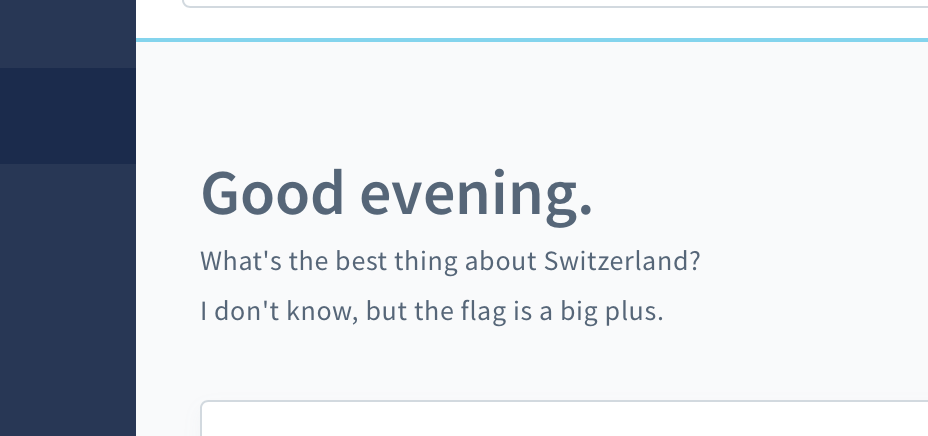

<h1 align="center">
    
</h1>

# Dashboard Joke

Lighten up your work day with a fresh joke every time you open the dashboard!



## Usage requirements

<p float="left">
    <a href="http://shopware.com"></a>
</p>

## Development requirements

<p float="left">
    <a href="https://git-scm.com"></a>
    <a href="https://cmake.org"></a>
    <a href="https://www.docker.com"></a>
</p>

## Usage

### Composer

Install and activate the plugin in your Shopware instance.

```shell
composer require family-office/dashboard-joke
```

```shell
bin/console plugin:refresh && bin/console plugin:install FamilyOfficeDashboardJoke --activate
```

The only thing that's left to do for the plugin to work is to build the administration.

```shell
bin/build-administration.sh
```

### Download

Alternatively to installing the plugin via Composer and building it yourself, you can download the latest pre-built release [here](https://github.com/FamilyOfficeOrg/FamilyOfficeDashboardJoke/releases/latest) and install it manually in your Shopware instance.

## Development

Clone the project into your Shopware installation

```shell
git clone git@github.com:FamilyOfficeOrg/FamilyOfficeDashboardJoke.git
```

```shell
cd FamilyOfficeDashboardJoke
```

Install the development dependencies

```shell
make install
```

..and start developing! 🥳

## Acknowledgements

Thanks to [Freepik](https://www.freepik.com) from [www.flaticon.com](https://www.flaticon.com/)
for providing the plugin icon.

We also thank [jokeapi.dev](https://jokeapi.dev) for providing the jokes via an easy-to-use REST API. 

## License

This project is licensed under the [MIT](LICENSE) license.  
Feel free to do whatever you want with the code!
